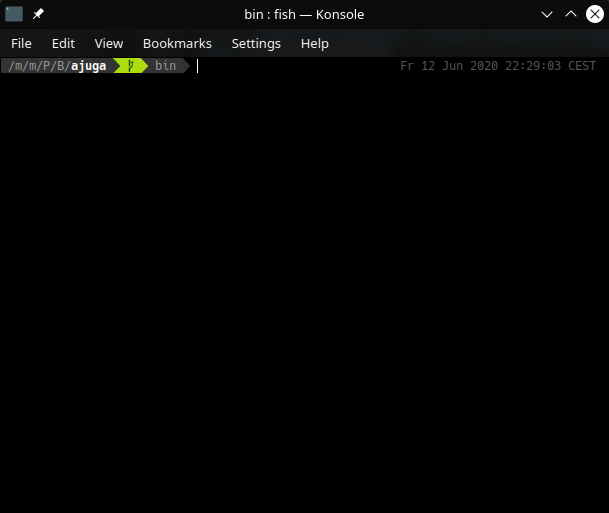
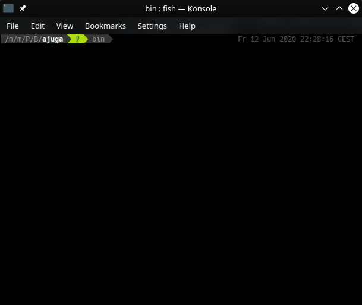

A CLI application that first translates and/or afterwards reads out what you type into the prompt.

## Installation

The Installation requires crystal and stards to be installed on your system.
For more information, go to [this link](https://crystal-lang.org/install).

```shell
git clone https://gitlab.com/BlobCodes/ajuga
cd ajuga
shards build --release
# The binary file is now in bin/ajuga
```

## Usage

You can either use the CLI:

```shell
ajuga -i (input language) [-o (output language)] [-t (translation backend)] [-a (audio backend)] [-s (tts backend)]
```



..or the (easier to use) prompt:

```shell
ajuga
```



After setting up the application, you'll see a text interface, into which you can type in your text.

## Development

TODO: Write development instructions here

## Contributing

1. Fork it (<https://gitlab.com/BlobCodes/ajuga/fork>)
2. Create your feature branch (`git checkout -b my-new-feature`)
3. Commit your changes (`git commit -am 'Add some feature'`)
4. Push to the branch (`git push origin my-new-feature`)
5. Create a new Pull Request

## Contributors

- [BlobCodes](https://gitlab.com/BlobCodes) - creator and maintainer
